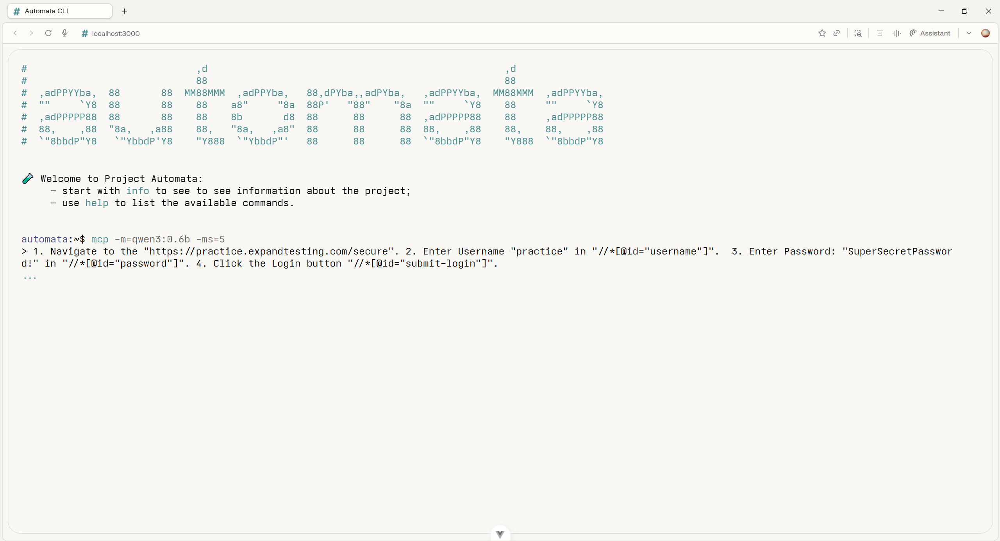
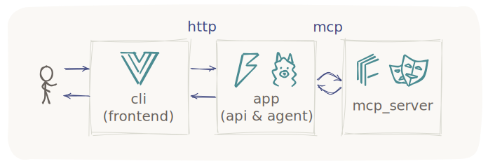
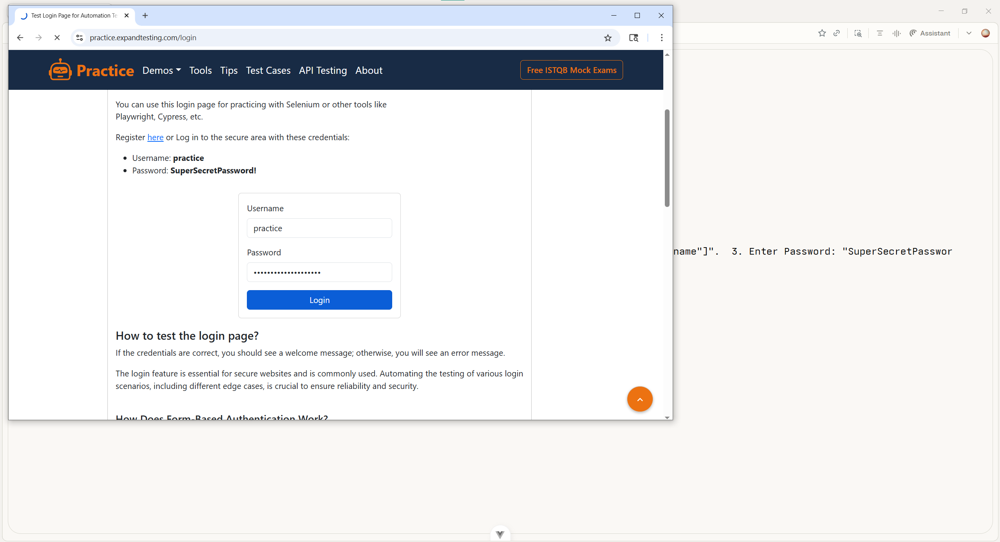

## Intelligent Browser Automation Platform with Local LLM Integration

**Project Automata** is a browser automation platform that combines Playwright with locally running LLMs via Ollama. Users can execute complex web tasks using natural language instructions while all processing remains on their own infrastructure.

The platform consists of a Vue-based web terminal interface and a FastAPI backend that orchestrates an intelligent agent. The agent translates user requests into browser actions using the Model Context Protocol (MCP), enabling seamless interaction with web pages without requiring manual scripting.



## Architecture

The system follows a modular design with clear separation between the user interface, orchestration layer, and automation components.

The web terminal communicates with the FastAPI backend over HTTP. The backend maintains an agent instance that coordinates between the Ollama LLM and the MCP server. The MCP server, running as a separate process, controls a Playwright browser instance to perform actions such as navigation, clicking, typing, and extracting information from web pages.

The agent processes user prompts by sending them to the LLM along with available tool definitions. When the model decides to perform an action, it returns a structured tool call. The agent executes this call through the MCP client, receives the result, and continues the loop until the task is complete or the maximum step limit is reached.



## Key Capabilities

The platform supports a wide range of browser automation tasks. Users can instruct the agent to navigate to any URL, click on elements using CSS selectors or XPath expressions, extract text content, fill forms, and retrieve page state information including screenshots. All interactions are handled through natural language, eliminating the need for manual scripting or complex configuration.

The agent respects exact selectors provided in user prompts and executes them precisely. For exploratory tasks, it can discover interactive elements and text content on the page before deciding on appropriate actions.

Because the LLM runs locally through Ollama, all data remains on the user's machine. No browsing activity or page content is transmitted to external services.



## Installation

Clone the repository:

```bash
git clone https://github.com/whirlvoid/project-automata.git
cd project-automata
```

The project contains two main directories:

`mcp/` — Backend with Python FastAPI server, MCP client, and automation logic

`cli/` — Frontend Vue 3 terminal interface

Backend Setup (`mcp/`):

```bash
cd mcp
python -m venv venv
source venv/bin/activate  # On Windows: venv\Scripts\activate
pip install -r requirements.txt
playwright install chromium
```
Frontend Setup (`cli/`):
```bash
cd cli
npm install
```

Pull a model for the agent to use:

```bash
ollama pull qwen3:0.6b
```
For better accuracy with complex tasks, consider a larger model and configuring it in the `mcp/app/config.py` config.

## Running the Application

Start the backend server from the mcp directory:

```bash
cd mcp
python -m app.main
```
The server will start at `http://localhost:8000`

Start the frontend development server from the cli directory:

```bash
cd cli
npm run dev
```
The frontend will be available at `http://localhost:3000`

## Using the Terminal
Once the frontend is open, basic commands are available:

`help` – Display available commands

`info` – Show project information

`clear` – Clear terminal screen

`main` – Return to main screen

To start the automation agent, use:

```text
mcp -m=qwen3:0.6b -ms=5
```
The options are:

`-m=<model>` — LLM model for execution

`-ms=<steps>` — Maximum execution steps

After entering the command, you will be prompted for a task. For example:

```text
Go to https://example.com and get the page title
```
The agent will then execute the task and display the result.

## License and Attribution

Project Automata is released under the Apache License 2.0. This license permits use, modification, and distribution for both commercial and non-commercial purposes, with the requirement that derivative works retain attribution and include a copy of the license.

The project relies on several open-source components. Playwright provides the browser automation capabilities. Ollama enables local LLM serving. FastAPI powers the API layer. Vue 3 and TypeScript form the foundation of the frontend interface. The Model Context Protocol standardizes tool calling between components.

The web terminal interface uses the IoskeleyMono font, a custom configuration of Iosevka (https://github.com/ahatem/IoskeleyMono), licensed under the SIL Open Font License 1.1.